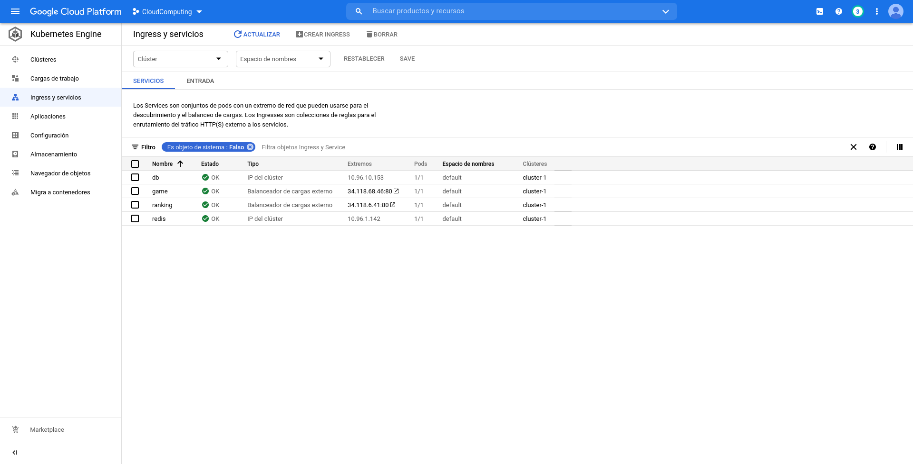

# Tarea: Kubernetes

## Enunciado

Crea un clúster kubernetes en GCP (Google Kubernete Engine - GKE).

Desarrolla una aplicación basada en microservicios, usando un tecnología a tu elección, que se conecte a un almacenamiento redis y/o a una base de datos SQL o noSQL.  Utiliza como ejemplo la aplicación Vote-App (https://github.com/jluisalvarez/k8s-vote-app)

Utiliza los comandos para escalar la aplicación.

Desarrolla nuevas versiones y utiliza las diferentes estrategias de despliegue de kubernetes.

Crea un repositorio Github con los ficheros yaml desarrollados y un fichero Readme.md describiendo el proceso de desarrollo, escalado y actualización de versiones  y copia la ruta al repositorio en esta tarea.

## Creación del cluster de Kubernetes en GCP

Para crear el cluster debemos activar Kubernetes Engine API en nuestro proyecto. Dentro de la sección "Clusteres de Kubernetes" pulsamos en "Crear"

Seleccionamos "Estandar"

Y rellenamos el formulario con los datos del cluster

Esto nos creará el cluster preconfigurado para añadir los servicios

## Desarrollo de la aplicación

La aplicación que hemos desarrollado consiste en un juego de preguntas y respuestas.

La página web muestra un pequeño formulario, donde se nos preguntará el resultado de una operación matemática y nuestro nombre de usuario. Si acertamos, nos muestra un mensaje de "Resultado correcto", si fallamos otro de "Resultado incorrecto".

La aplicación cuenta con un ranking en el que se muestran los usuarios registrados y su puntuación. Las respuestas correctas suman 5 puntos, las incorrectas 0.

Accediendo a otra página podemos ver el ranking con la lista de usuarios y sus puntuaciones, ordenados de mayor a menor.

### Implementación

Para implementar la aplicación hemos utilizado Flask, combinado con plantillas HTML. Los datos de los usuarios y sus partidas se almacenan en una base de datos MySQL, accesible desde la aplicación. 

A su vez, debido a que en cada carga de la web se resetean los números, los operandos de la pregunta se almacenan temporalmente en un almacenamiento Redis, del cual se recuperan al pulsar para comprobar la respuesta.

Los ficheros de cada nodo son los siguientes;

- Juego: almacenado en [webgame.py](https://github.com/AlmuHS/Practica_Kubernetes_MySQL/blob/main/python-webgame/webgame.py)
- Ranking: almacenanado en [check_results.py](https://github.com/AlmuHS/Practica_Kubernetes_MySQL/blob/main/python-ranking/check_results.py)

- Base de datos: Basada en el script [test.sql](https://github.com/AlmuHS/Practica_Kubernetes_MySQL/blob/main/mariadb/sql/test.sql)

### Estructura de la aplicación

La estructura de la aplicación es la siguiente

## Despliegue en Docker

Antes de desplegar el cluster en Kubernetes, preparamos la infraestructura desde Docker

### Creación de las imágenes

Para crear las imágenes, utilizamos los Dockerfile asociados a cada contenedor.

	sudo docker build mariadb/ -t gamedb
	sudo docker build python-webgame/ -t gameapp
	sudo docker build python-ranking/ -t gameranking

Esto generará las imágenes de los tres contenedores. El contenedor de redis se desplegará desde su imagen oficial

Las imágenes se llamarán `gamedb` para la base de datos, `gameapp` para el juego, y `gameranking` para el ranking

#### Particularidades

La imagen de la base de datos tendrá las siguientes credenciales:

- **Base de datos:** GameDB
- **Usuario:** gameusr
- **Contraseña:** game

A su vez, las imágenes del juego y el ranking requerirán del parámetro `MYSQL_HOST` para indicar el host de la base de datos

### Subida de las imágenes a Docker Hub

Una vez generadas las imágenes, las subimos a Docker Hub

#### Subida de la base de datos

Para subir la imagen de la base de datos, utilizamos la siguiente secuencia de comandos

	sudo docker tag gamedb almuhs/gamedb:v1
	sudo docker push almuhs/gamedb:v1

Esto subirá la imagen en el repositorio [almuhs/gamedb](https://hub.docker.com/repository/docker/almuhs/gamedb)

#### Subida del juego

Para subir la imagen del juego, utilizamos los siguientes comandos

	sudo docker tag gameapp almuhs/gameapp:v1
	sudo docker push almuhs/gameapp:v1

Esto subirá la imagen en el repositorio [almuhs/gameapp](https://hub.docker.com/repository/docker/almuhs/gameapp)

#### Subida del ranking

Para subir la imagen del ranking, utilizamos los siguientes comandos

	sudo docker tag gameranking almuhs/gameranking:v1
	sudo docker push almuhs/gameranking:v1

Esto subirá la imagen en el repositorio [almuhs/gameranking](https://hub.docker.com/repository/docker/almuhs/gameranking)

### Prueba con Docker Compose

Para probar que todo funcione, montamos la infraestructura en local con Docker Compose. El fichero `docker-compose.yml` se encuentra en la raíz del repositorio, así que podemos ejecutarlo simplemente con

	sudo docker-compose up -d

Si todo ha ido bien, veremos algo como esto:

	almu@debian:~/Practicas_CC/Tarea7$ sudo docker-compose up -d
	Creating network "tarea7_mynet" with driver "bridge"
	Creating mariagame ... done
	Creating redis     ... done
	Creating webgame   ... done
	Creating ranking   ... done

### Probando la aplicación en local

Para probar la aplicación, abrimos las URL

http://localhost:8080 para el juego
http://localhost:8081 para el ranking

En el juego veremos una página como esta

Introducimos un nombre de usuario, y la respuesta a la pregunta

Si el resultado es correcto, veremos esta pantalla

Si el resultado es incorrecto, veremos esta otra

Finalmente, si entramos en el ranking veremos una pantalla como esta

## Desplegando la aplicación en Kubernetes sobre GCP

### Ficheros de configuración

Para desplegar la aplicación en Kubernetes, creamos varios ficheros Yaml correspondientes a los nodos que queremos crear.

Para cada nodo creamos un fichero de despliegue, que definirá la infraestructura (red, volumen y contenedor); y otro fichero de servicio, que definirá el tipo de nodo a crear y la salida al exterior del mismo

La colección de ficheros se encuentra [aquí](https://github.com/AlmuHS/Practica_Kubernetes_MySQL/tree/main/kubernetes)

Los servicios web, del juego y del ranking, se definirán como tipo LoadBalancer, con una sola réplica cada uno. Por contra, los servicios de Redis y de la base de datos se definirán como ClusterIP.

A los servicios web se les asignará la variable `MYSQL_HOST` con el nombre del pod donde se aloja la base de datos (en este caso, `db`). Esto permitirá su conexión con el pod de la base de datos.

### Instalación del SDK de Google

Para desplegarlo en GCP, hacemos uso del SDK de Google, que lo instalamos siguiendo los pasos de la [documentación oficial](https://cloud.google.com/sdk/docs/install#deb) para Debian y Ubuntu.

#### Añadiendo el repositorio

Añadimos el repositorio oficial de GCP a nuestro fichero `sources.list`

	echo "deb [signed-by=/usr/share/keyrings/cloud.google.gpg] https://packages.cloud.google.com/apt cloud-sdk main" | sudo tee -a /etc/apt/sources.list.d/google-cloud-sdk.list
	
Instalamos algunos paquetes necesarios para los repositorios https
	
	sudo apt-get install apt-transport-https ca-certificates gnupg

Importamos la clave pública del repositorio

	curl https://packages.cloud.google.com/apt/doc/apt-key.gpg | sudo apt-key --keyring /usr/share/keyrings/cloud.google.gpg add -

#### Instalando el SDK

Finalmente, con el repositorio ya añadido, actualizamos los índices de apt e instalamos el SDK

	sudo apt-get update && sudo apt-get install google-cloud-sdk

### Acceso al cluster de GCP desde el SDK

Una vez instalado el SDK, iniciamos sesión en nuestro proyecto de Google

#### Inicializando la configuración

Para inicializar la configuración, utilizamos el comando

	gcloud init

Esto nos preguntará sobre nuestra zona horaria, y algunos datos mas, e inicializará la sesión

#### Autenticándonos en Google Cloud

Realizado este paso inicial, nos autenticamos utilizando el comando

	gcloud auth login

Este nos mostrará un enlace en la terminal. Lo abrimos desde el navegador 

Pulsamos en "Permitir". Esto realizará la autenticación en GCP

#### Conectándonos al cluster

Finalmente, nos conectamos al cluster con el comando

	gcloud container clusters get-credentials [nombre-cluster] --zone [zona-horaria] --project [nombre-proyecto]

Sustituyendo cada dato por el correspondiente a nuestro cluster y proyecto

### Desplegando la aplicación

Una vez conectados a GCP, desplegamos la aplicación en el cluster de Kubernetes que creamos en nuestro proyecto

#### Instalando `kubectl`

Para poder realizar el despliegue, necesitamos el comando `kubectl`. En Debian, podemos instalarlo con el paquete `kubernetes-client`

	sudo apt install kubernetes-client

#### Realizando el despliegue

Finalmente, desplegamos la aplicación con los comandos

	kubectl create -f kubernetes/
	kubectl apply -f kubernetes/

Si todo va bien, veremos algo como esto:

	deployment.apps/db created
	service/db created
	deployment.apps/game created
	service/game created
	deployment.apps/ranking created
	service/ranking created
	deployment.apps/redis created
	service/redis created

## Probando el cluster

Para comprobar si el cluster se ha desplegado correctamente, entramos a la web de GCP, y revisamos el Kubernetes Engine

Revisamos las cargas de trabajo. Vemos los 4 nodos que hemos desplegado en el cluster

Revisamos los servicios

Vemos que los servicios se han activado correctamente. Además, en "game" y "ranking", vemos las IP públicas asociadas a los mismos.

En este caso son:

http://34.118.68.46/ para el juego

http://34.118.6.41/ para el ranking

Tras jugar un rato, vemos que las conexiones funcionan correctamente

